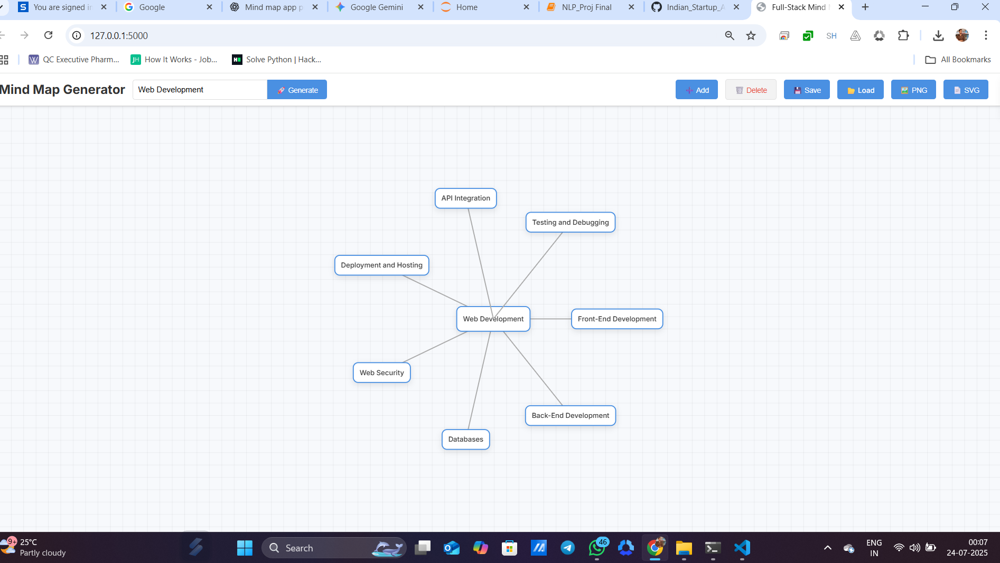

# 🧠 Full-Stack Mind Map Generator

A web-based interactive application to **generate**, **visualize**, and **edit** mind maps. The frontend leverages **HTML, CSS, and D3.js**, while the backend is powered by **Flask**. Optional integration with **Google's Gemini API** provides AI-generated subtopic suggestions for a smarter brainstorming experience.

---

## 🚀 Features

- 🔍 **Auto-generation**: Enter a central idea to generate an initial mind map.
- 💡 **AI Suggestions**: (Optional) Use Gemini API to suggest related subtopics.
- 🖱️ **Interactive UI** with D3.js:
  - Drag-and-drop nodes freely
  - Double-click to edit node content
  - Add/delete child nodes
- 💾 **Save & Load**: Export mind maps as JSON and reload anytime.
- 🖼️ **Export**: Save your map as PNG or SVG.
- ⚙️ **Lightweight** and fully customizable.

---


## 🌐 Live Demo

You can also check the live version here:  
🔗 [https://indian-startup-analysis-57rq.onrender.com/]

---

## 📁 Project Structure

```bash
mind-map-generator-flask/
├── static/
│ ├── style.css # Frontend styling
│ └── script.js # D3.js and UI logic
├── templates/
│ └── index.html # Main frontend HTML
├── app.py # Flask backend server
└── README.md # Project documentation
```

---

## 🖼️ Demo Screenshots

### 📊 Dashboard Overview


---


## 🛠️ Setup & Run Locally

### 1. Prerequisites

- Python 3.7 or higher
- `pip` and `venv` installed

### 2. Backend Setup

#### Step 1: Clone or Create Project Files

You can clone this repo or recreate the above structure manually.

#### Step 2: Create and Activate Virtual Environment

```bash
# Create environment
python -m venv venv

# Activate environment
# On Windows
.\venv\Scripts\activate

# On macOS/Linux
source venv/bin/activate
Step 3: Install Required Packages
pip install Flask
Step 4 (Optional): Enable AI Suggestions
To use Google's Gemini API:

pip install google-generativeai
Set your Gemini API Key:

Visit Google AI Studio to get your key.

Set it as an environment variable:

export GEMINI_API_KEY=your_api_key_here  # macOS/Linux
set GEMINI_API_KEY=your_api_key_here     # Windows
In app.py, uncomment the Gemini-related code and comment out the placeholder logic.

3. Run the Application
With your virtual environment active:

python app.py
Visit http://127.0.0.1:5000 in your browser to start using the Mind Map Generator.

📌 Note
This project is fully local—no data is stored online.

Easily extendable for educational, productivity, or brainstorming tools.

Ideal for students, educators, and idea-focused teams.

📬 Feedback
Found an issue or have an idea to improve this tool? Contributions and suggestions are welcome!

---

## 👨‍💻 Author

**Rahul Kumar**  
🔗 [LinkedIn](https://www.linkedin.com/in/rahul-kumar-8ab740268/)  
📧 aiwithrahul25@gmail.com  
🎥 [YouTube: AI with Rahul](https://www.youtube.com/@aiwithrahul25)

---

